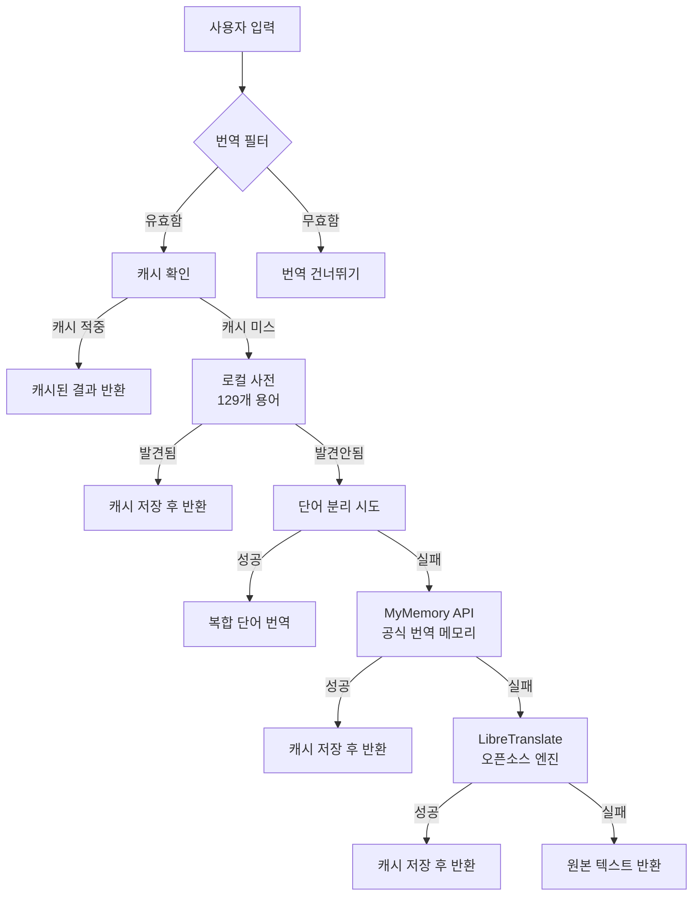
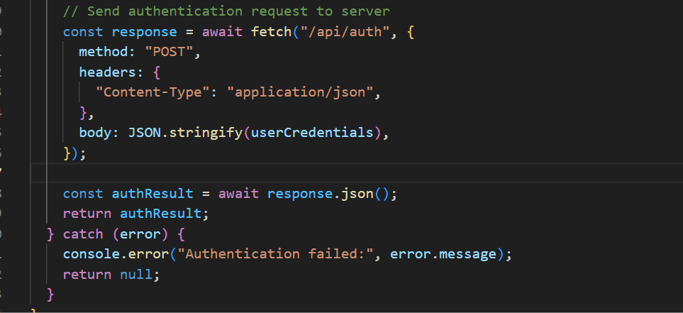
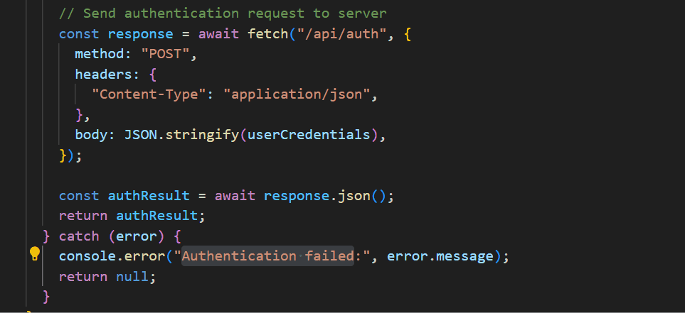

# Korean Code Translator for VS Code

> 영어 주석과 변수명을 실시간으로 한국어 번역해주는 전문적인 IDE 확장 프로그램

[](https://code.visualstudio.com/)
[](https://opensource.org/licenses/MIT)
[](https://www.typescriptlang.org/)
[]()

## 개요

Korean Translator는 영어로 작성된 프로그래밍 요소들을 한국어로 실시간 번역하여 개발자의 생산성을 향상시키는 정교한 VS Code 확장 프로그램입니다. **안정성과 법적 안전성**을 최우선으로 하여 설계된 **3단계 번역 아키텍처**와 스마트 캐싱, 상황 인식 필터링 기능을 제공합니다.

## 핵심 기능

### 주요 기능

- **지능형 호버 번역**: 디바운싱이 적용된 마우스 호버 시 상황 인식 번역
- **키보드 단축키 번역**: 사용자 정의 단축키를 통한 인라인 즉시 번역
- **안정적인 3단계 번역 엔진**: 합법적이고 신뢰할 수 있는 서비스들로만 구성
- **스마트 콘텐츠 필터링**: 불필요한 번역 시도를 방지하는 고도화된 패턴 인식
- **성능 최적화 캐싱**: 자동 정리 기능을 갖춘 메모리 효율적 캐싱 시스템

## 시스템 아키텍처



### 호버 번역 예시

영어 주석이나 변수에 마우스를 올리면 자동으로 번역이 표시됩니다:



---

### 단축키 번역 예시

`Ctrl+Shift+T` 또는 `Cmd+Shift+T`로 현재 커서 위치의 단어를 번역할 수 있습니다:



### 번역 파이프라인

1. **로컬 사전**: 즉시 검색을 위한 **129개** 핵심 프로그래밍 용어
2. **MyMemory API**: 전문 번역 메모리 데이터베이스 (공식 API, 일일 1,000단어 무료)
3. **LibreTranslate**: 오픈소스 번역 엔진 (무료, 무제한)

## 설치 방법

### VS Code 마켓플레이스에서 설치

```bash
code --install-extension sonsanghee-dev.korean-code-translator
```

- 마켓플레이스: https://marketplace.visualstudio.com/items?itemName=sonsanghee-dev.korean-code-translator
- GitHub: https://github.com/Higangssh/korean-translator
- 이슈 리포트: https://github.com/Higangssh/korean-translator/issues

### 개발 버전 설치

```bash
git clone https://github.com/Higangssh/korean-translator.git
cd korean-translator
npm install
npm run compile
npm run watch  # (그냥 F5만 눌러도 됩니다)
```

## 설정 옵션

VS Code 설정에서 포괄적인 구성 옵션을 제공합니다:

```json5
{
  // 핵심 기능 토글
  "korean-translator.enabled": true,
  "korean-translator.autoTranslateComments": true,
  "korean-translator.autoTranslateVariables": true,

  // 성능 튜닝
  "korean-translator.minimumWordLength": 3,
  "korean-translator.debounceDelay": 300
}
```

## 사용 방법

### 호버 번역

영어 식별자나 주석에 커서를 올리면 자동 번역이 실행됩니다:

```typescript
// This function handles user authentication processes
async function authenticateUser(credentials: UserCredentials) {
  const validationResult = validateCredentials(credentials);
  return validationResult;
}
```

### 키보드 단축키

| 플랫폼        | 단축키         | 동작                |
| ------------- | -------------- | ------------------- |
| Windows/Linux | `Ctrl+Shift+T` | 커서 위치 단어 번역 |
| macOS         | `Cmd+Shift+T`  | 커서 위치 단어 번역 |

### 명령 팔레트

`Ctrl+Shift+P` (Windows/Linux) 또는 `Cmd+Shift+P` (macOS)를 통해 접근:

- `Korean Translator: 번역하기`
- `Korean Translator: 번역 기능 토글`
- `Korean Translator: 캐시 초기화`
- `Korean Translator: 캐시 상태 확인`

## 번역 필터링

성능과 관련성을 최적화하기 위한 정교한 필터링을 적용합니다:

### 제외 패턴

- **숫자 리터럴**: `123`, `3.14159`, `-42`
- **색상 코드**: `#ffffff`, `rgb(255,0,0)`, `hsl(120,100%,50%)`
- **CSS 단위**: `px`, `em`, `rem`, `vh`, `vw`
- **파일 확장자**: `.js`, `.ts`, `.json`
- **URL**: `https://example.com`, `www.site.org`
- **단일 문자**: `a`, `x`, `i`
- **특수 기호**: `!!`, `&&`, `||`, `++`

### 포함 기준

- 최소 3글자 이상
- 알파벳 문자 포함
- 한글(Hangul)이 아님
- 제외 사전에 없음
- 유효한 영어 단어 패턴

## API 통합

### 외부 서비스

| 서비스         | 우선순위 | 요청 제한     | 품질      | 공식 API | 대체 서비스    |
| -------------- | -------- | ------------- | --------- | -------- | -------------- |
| 로컬 사전      | 1차      | 무제한        | 높음      | N/A      | 해당없음       |
| MyMemory       | 2차      | 1,000단어/일  | 매우 높음 | ✅       | LibreTranslate |
| LibreTranslate | 3차      | 무제한        | 보통      | ✅       | 원본 텍스트    |

## 로컬 사전 (129개 핵심 용어)

### 프로그래밍 기본 용어
- `function` → "함수", `method` → "메서드", `class` → "클래스"
- `variable` → "변수", `array` → "배열", `object` → "객체"

### 사용자 관련
- `user` → "사용자", `admin` → "관리자", `account` → "계정"

### 데이터 관련  
- `data` → "데이터", `info` → "정보", `name` → "이름"

### 동작 관련
- `get` → "가져오다", `set` → "설정하다", `create` → "생성하다"
- `delete` → "삭제하다", `update` → "업데이트하다"

### 클라우드/인프라
- `aws` → "AWS", `s3` → "S3", `database` → "데이터베이스"
- `server` → "서버", `api` → "API"

### 보안 관련
- `auth` → "인증", `token` → "토큰", `password` → "비밀번호"

## 개발 환경

### 필수 요구사항

- Node.js ≥ 20.x
- TypeScript ≥ 5.8.0
- VS Code ≥ 1.70.0

### 빌드 프로세스

```bash
# 의존성 설치
npm install

# 웹팩 빌드
npm run compile

# 감시 모드(그냥 F5 만 눌러도 됩니다.)
npm run watch

# 프로덕션 빌드
npm run package

# 확장 프로그램 패키징
npm run vscode:prepublish
vsce package
```

### 프로젝트 구조

```
src/
├── extension.ts                      # 확장 프로그램 진입점
├── hoverProvider.ts                  # 호버 이벤트 처리
├── translationService.ts             # 레거시 인터페이스
└── translation/                      # 새로운 번역 아키텍처
    ├── TranslationService.ts         # 메인 번역 서비스
    ├── core/                         # 핵심 로직
    │   ├── TranslationEngine.ts      # 번역 엔진
    │   ├── TranslationCache.ts       # 캐시 관리
    │   ├── TextProcessor.ts          # 텍스트 전처리
    │   └── TextValidator.ts          # 입력 검증
    ├── strategies/                   # 번역 전략들
    │   ├── ITranslationStrategy.ts   # 전략 인터페이스
    │   ├── LocalTranslationStrategy.ts # 로컬 사전
    │   ├── MyMemoryTranslationStrategy.ts # MyMemory API
    │   ├── LibreTranslationStrategy.ts # LibreTranslate
    │   └── BaseOnlineTranslationStrategy.ts # 온라인 전략 기본
    └── factory/
        └── TranslationStrategyFactory.ts # 전략 팩토리

dist/                                 # 컴파일된 JavaScript 출력
package.json                          # 확장 프로그램 매니페스트
tsconfig.json                        # TypeScript 구성
webpack.config.js                    # 번들 최적화
```

## 성능 지표

### 메모리 사용량

- 기본 메모리 사용량: ~2MB
- 캐시 크기: 5-10KB (일반적인 세션)
- 메모리 정리: 창 닫기 시 자동

### 응답 시간

- 로컬 사전: <1ms
- 캐시 히트: <5ms
- MyMemory API: 100-2000ms (네트워크 의존)
- LibreTranslate: 1000-3000ms (네트워크 의존)
- 호버 디바운싱: 기본 300ms

## 안정성 및 법적 안전성

###  **안정성 개선 (v1.0.8)**
- **공식 API만 사용**: 모든 온라인 번역 서비스가 공식 API 사용
- **ToS 준수**: 서비스 약관 위반 없는 깨끗한 구현
- **예측 가능한 서비스**: 예고 없는 중단 위험 최소화


## V2 향후 로드맵

- [ ] 사용량 분석 대시보드
- [ ] 고급 컨텍스트 인식 (AI 기반)
- [ ] 팀 공유 번역 메모리
- [ ] 실시간 협업 번역
- [ ] 외부 CAT 도구 통합
- [ ] 다국어 지원 (일본어, 중국어)
- [ ] 공식 Google Translate API 통합 (API 키 필요)

## 문제 해결

### 일반적인 문제

**번역이 나타나지 않는 경우**

```bash
# 확장 프로그램 상태 확인
개발자 도구 → 콘솔 → 필터: "KoreanTranslator"

# 구성 확인
CMD/Ctrl + , → 검색: "korean-translator"
```

**API 요청 제한**

- MyMemory: IP당 1,000단어/일
- LibreTranslate: 무제한 (공개 인스턴스)
- 해결방법: 일일 제한 도달 시 다음 날까지 대기(향후 LLM 서비스 지원 고민중)

**성능 문제**

- 번역 캐시 초기화: `CMD/Ctrl + Shift + P` → "Korean Translator: 캐시 초기화"
- 설정에서 디바운스 지연 조정
- 네트워크 연결 확인

## 보안 및 개인정보

- **데이터 영구 저장 없음**: 번역은 메모리에만 캐시됨
- **API 통신**: 모든 외부 호출은 HTTPS 사용
- **사용자 추적 없음**: 분석 없이 로컬에서만 작동
- **소스 코드 투명성**: 보안 감사를 위한 완전 오픈소스
- **공식 API 사용**: 모든 외부 서비스가 공식 API 또는 허용된 엔드포인트 사용

## 라이센스

이 프로젝트는 MIT 라이센센스 하에 라이센스 됩니다 - 자세한 내용은 [LICENSE](LICENSE) 파일을 참조하세요.

## 문의

- **이메일**: sonsanghee3@gmail.com
- **GitHub Issues**: 자유 형식으로 이슈 올려주시면 처리하겠습니다.

## 감사의 말

- 전문 번역 메모리 API를 제공해주신 [MyMemory](https://mymemory.translated.net/)
- 오픈소스 번역 인프라를 제공해주신 [LibreTranslate](https://libretranslate.com/)
- VS Code Extension API 문서와 커뮤니티 기여자들

---

